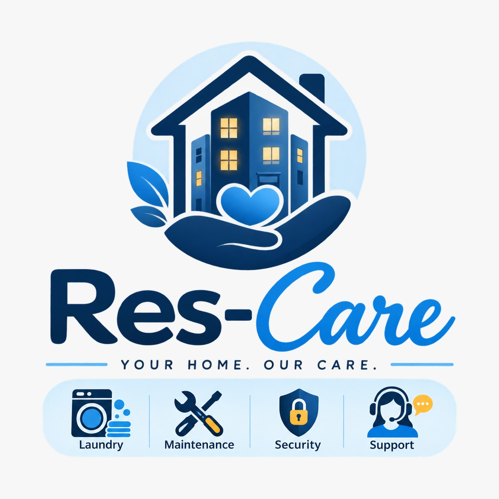

<p align="center">
	
</p>

<h1 align="center">ResCare</h1>

ResCare is a mobile Android application prototype for residents of serviced apartments and student accommodations. It brings everyday residential services into one place instead of relying on notice boards, scattered WhatsApp groups, and word of mouth.

## Purpose

Residential service information is often difficult to find and easy to lose. This can lead to double-booked laundry facilities, slow maintenance responses, and residents not knowing who to contact during an emergency.

ResCare is designed to provide a single, clear, and accessible platform for residents and accommodation staff.

## Target Users

- **Residents:** The primary users who need to book services, find staff contacts, and access residential information.
- **Accommodation staff:** The secondary users who support laundry, maintenance, security, and resident communication.

## Planned Application Areas

| Area | Capability |
| --- | --- |
| Home dashboard | Time-aware greeting, announcements, quick actions, laundry status, recent maintenance, and activity feed |
| Laundry | View available slots by date, choose a machine, book a slot, and manage bookings |
| Maintenance | Report issues with a category, priority, description, and photo, then track the status |
| Staff directory | View contact details and shift hours for accommodation staff |
| Emergency | One-tap access to security, ambulance, police, fire, and after-hours caretaker contacts |
| Settings | Edit a profile, manage notification toggles, change app preferences, reset data, and sign out |

## Current Android Prototype

The current repository contains a native Android prototype with these implemented flows:

- Login screen
- Account registration
- Local account persistence using Android `SharedPreferences`
- Home screen navigation
- Laundry date, time-slot, and machine selection
- Visible selection feedback for laundry choices
- Laundry booking confirmation
- Staff directory screen
- Navigation from the staff directory back to laundry
- ResCare launcher logo

Maintenance, emergency contacts, settings, announcements, and authenticated backend persistence remain part of the broader application vision and can be added in later iterations.

## Design Principles

- **Simple navigation:** Core areas should remain accessible with minimal taps.
- **One primary action per screen:** Each screen should make the next step obvious, such as booking a slot or reporting an issue.
- **Clear status language:** Maintenance requests should have unambiguous statuses and colour-coded priorities.
- **Low-friction emergencies:** Emergency contacts should be clearly labelled and easy to call.
- **Responsive layout:** The interface should work on phones first, with a wider-screen fallback where appropriate.
- **Reusable components:** Shared UI patterns should remain consistent and easy to maintain.
- **Privacy by design:** Resident information should be validated and eventually stored through a properly authenticated backend rather than insecure client-only persistence.

## Technology

- Kotlin
- Android application module
- Android Gradle Plugin
- AndroidX Core KTX
- AndroidX AppCompat
- AndroidX Activity
- Material Components
- ConstraintLayout
- XML layouts and drawable resources

## Project Structure

```text
ResCare/
├── app/
│   └── src/
│       ├── androidTest/       # Instrumentation tests
│       ├── main/
│       │   ├── java/          # Kotlin activities
│       │   └── res/           # Layouts, drawables, themes, and app resources
│       └── test/               # Local unit tests
├── gradle/
│   └── libs.versions.toml    # Dependency versions
├── build.gradle.kts
├── settings.gradle.kts
├── gradlew
└── gradlew.bat
```

## Getting Started

1. Open the project directory in Android Studio.
2. Allow Android Studio to sync the Gradle project.
3. Install the Android SDK platform requested by the Gradle configuration if Android Studio prompts you.
4. Select an emulator or connected Android device.
5. Run the `app` configuration.

The app opens on the login screen. Use **Create an account** to create local test credentials, then sign in with those credentials.

## Data and Security Notes

The current prototype stores registration details locally with `SharedPreferences` for demonstration purposes. This is not a replacement for secure production authentication or backend persistence. A production version should use an authenticated backend, secure credential handling, validation, and appropriate privacy controls.

## Version Control

The project is maintained in Git and hosted on GitHub:

[github.com/lesedindivhuho/ResCare](https://github.com/lesedindivhuho/ResCare)

Git is used for version history, collaboration, code review, documentation, and project transparency.

## Reference

The original application concept and design reference were produced with Readdy:

[Readdy project reference](https://readdy.ai/project/b7775bcd-890a-4863-bc81-13748b490014)

## Collaborators

| Name and surname | Email |
| --- | --- |
| Tiisetso Mokoena | tiisetsomokoena900@gmail.com |
| Thabiso Morebodi | Morebodithabiso@gmail.com |
| Owam  Zililo | St10455219@Rcconnect.edu.za |
| Ndivhuho Nemaungani | nemaunganilesedi@gmail.com |
